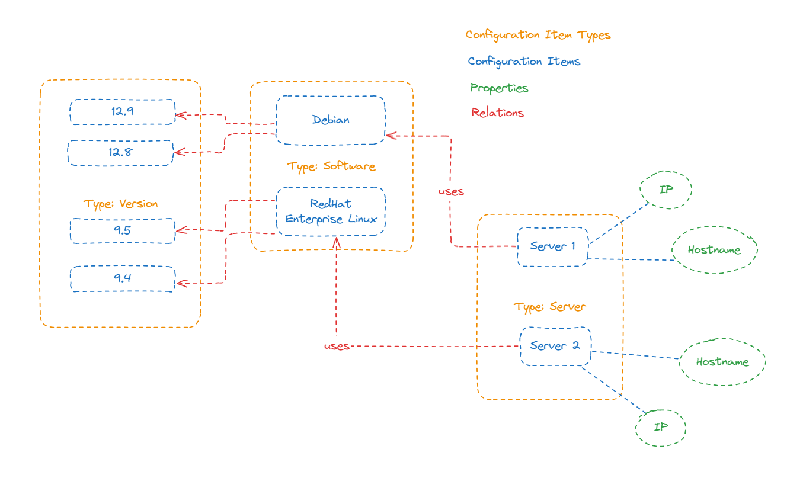
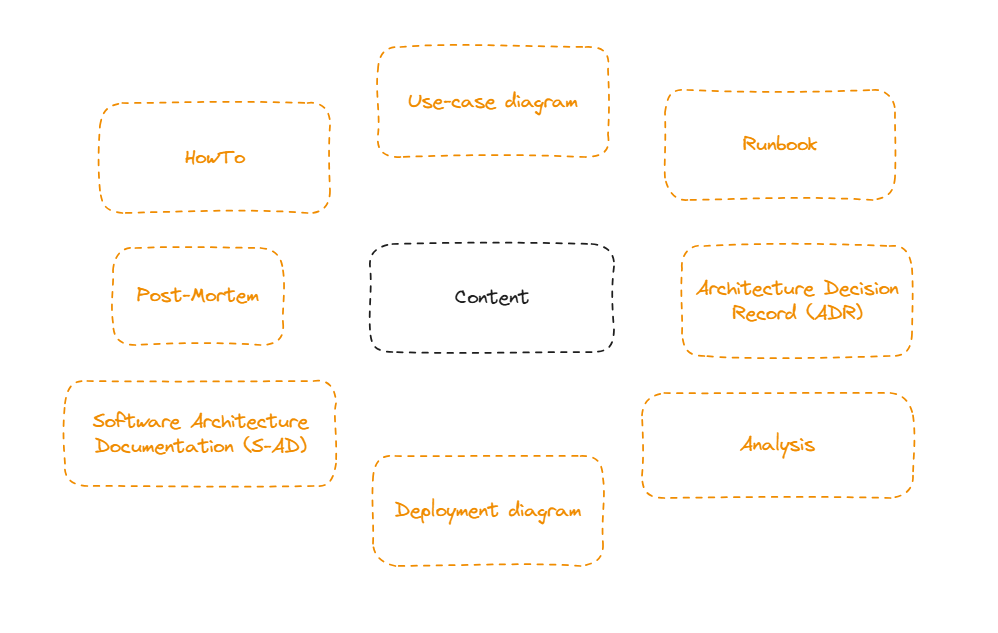
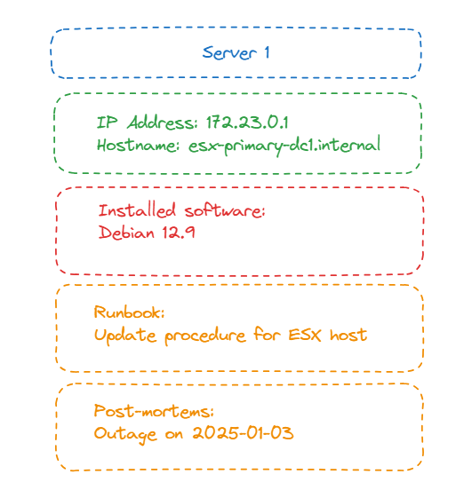

# Concepts

## Separation between data and content

swark strictly separates data and content. This is important so that you can mix structured and unstructured information.

### Data - structured information
Everything in your database is _data_. Your data consists upon __configuration item types__, e.g. `server`, `software` or `version`.
Each _configuration item type_ has a defined set of properties, e.g. `IP` or `Hostname` for a `server`.  Most used _Configuration item types_ and their _properties_ are part of the swark's data model. You get it automatically set up when you install swark. You can also add new properties or configuration items types at any time.
 
Based upon the data model you can create specific__configuration items__. They may have the same properties as other configuration items but they are not the same instance. For example, you have two `servers` with the same IP address and hostname. They have the same properties but they are definitely not the same.
Between _configuration items_ can exist __relations__. _Relations_ show how one configuration item interacts with another one. Which _relation_ you can use is defined in the data model.

You can manage configuration items and their relations through the management interface, via API or initially import them.
For changing the data model you need some kind of knowledge how databases have to be structured and how Laravel works.

### Content - unstructured information
Having a lot of tables and automatically generated diagrams gives you an overview over your architecture. But neither you nor your users are will be understand it without having a context. In swark, _content_ describes everything what is unstructured and available in your brains or any kind of custom diagrams or Word documents.

The _content_ in swark describes why a decision has been made, why a software is installed on a specific server in another way or how an interaction of different configuration items works.

## Pages
_Pages_ present your structured and unstructured information. Each page you visit in swark's frontend pulls structured information from the database or unstructured information from your content store and combines them in a meaningful way.

